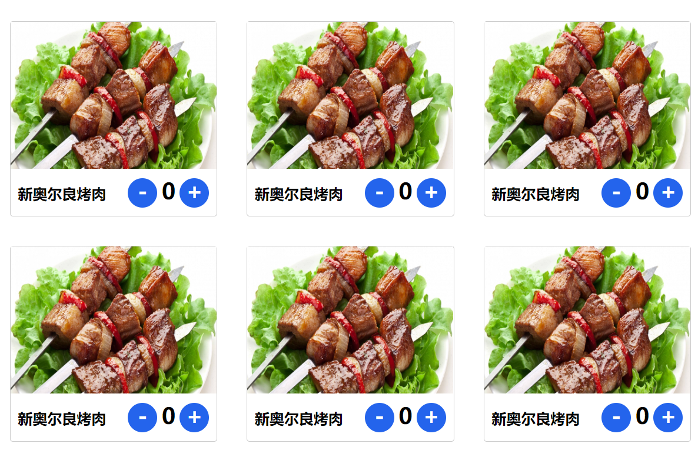
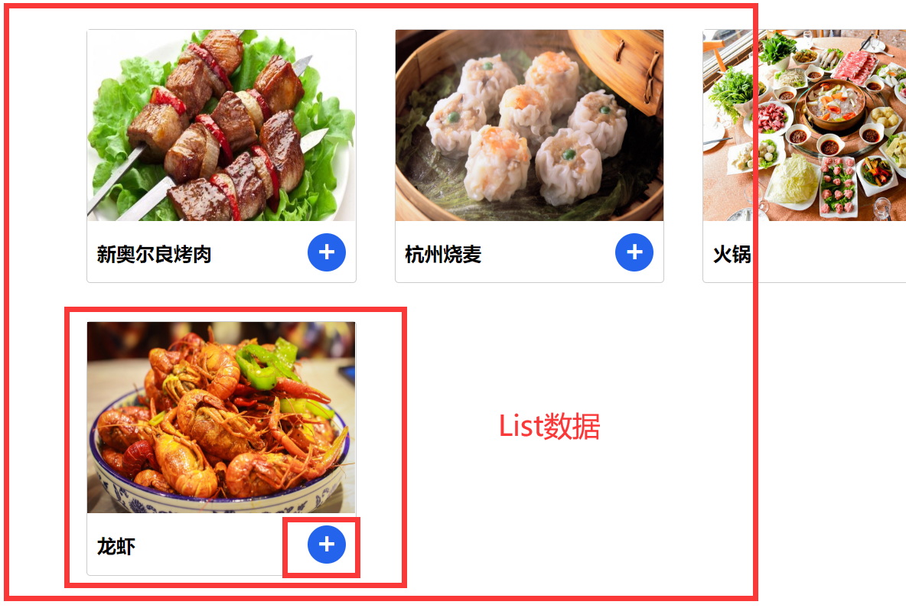
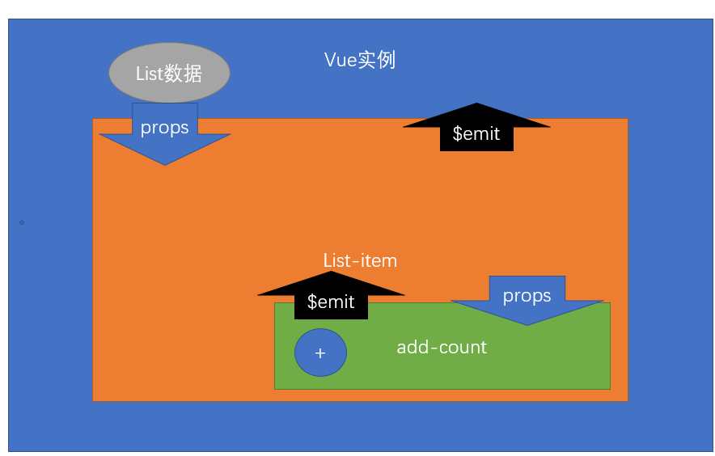
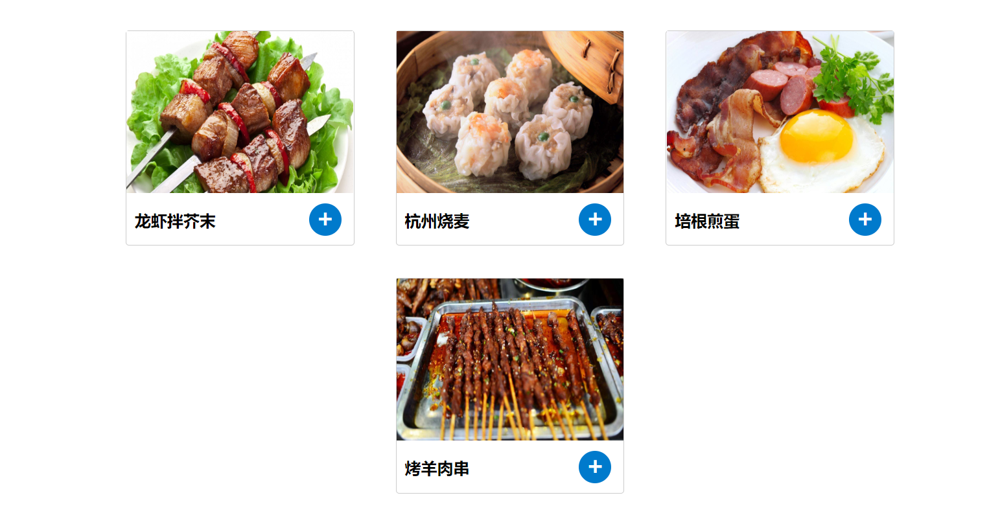

## 基础-组件-组件嵌套 及 组件通信的几种关系

**`目标`**掌握如何在组件中掌握嵌套

什么叫组件嵌套?

> 当我们在Vue实例的视图 或者组件中 使用了另外一个组件的标签时, 就已经完成了**`组件嵌套`**

```vue
<div id="app">
    <span-btn />
    <child-btn />
</div>

```

如上的代码,我们在Vue实例的视图中引用了 组件span-btn, 也就是 Vue实例中**`嵌套`**了 span-btn

span-btn中也可以继续嵌套

```vue
Vue.components('span-btn',{
template: `<div>
      <other-component />  // 其他组件
   </div>`
})
```

> 一旦形成了嵌套关系, 其实也就是**`父子组件`**关系,父组件就是我们外层的组件,子组件就是 嵌套的组件

* 组件之间有了关系, 但是由于组件之间的数据是独立的, 所以如果一个组件 想用另一个组件的数据,就需要

 进行传值, 那么组件间的传值 分几种?

1. 父组件  ->   子组件
2. 子组件 ->  父组件
3.  兄弟组件 / 非关系组件

**`任务`** 

1. 实现一个Vue实例
2. 定义一个全局组件 **`list-item`**, 为商品内容, 图片, 商品信息
3. 在**`list-item`**下 定义一个 局部组件 **`add-count`**, 内容为  加减数量
4. 在Vue实例所管理的视图中 生成 若干个**`list-item`** 



这个例子我们完成了 两层的嵌套, 至于怎么传值我们下一小节再讲

## 基础-组件-父组件给子组件传值Props

**`目标`**:掌握父组件用Props给子组件传值

上一小节,我们进行了组件的嵌套, 但是我们并没有将Vue实例的数据传给**`list-item`**, 也没传给**`add-count`**组件数量

> 所以我们要完成父组件 给子组件传值  

首先是Vue实例数据 传给**`list-item`**,

> 我们要用props特性进行 父组件 传给子组件的过程

1. 第一步,我们需要在**`list-item`**的标签上定义属性 

​     **`口令`** **`给谁传值 就在谁的标签上定义属性`**, 属性名可以随意定义

  ```vue
    <list-item :food="item" v-for="item in list" />
  // 为什么写: 因为是动态变量 所以写:
  ```

2. 第二步 我们需要 在**`list-item`**的组件实例上用props接收属性

  Props有多种表现形式,可以是数组,可以是对象,这里我们先学最简单的数组

```js
{
    props: ["food"] // 数组里就是我们第一步写入的属性名
}
```
3. 第三步, 我们已经可以获取food属性了, 怎么取呢 , data中的变量你怎么取, props就怎么取

> 我们可以通过 this.属性 获取data中的数据 /props中的数据/计算属性/ methods方法

```js
{{ food }}
```

现在我们已经将 Vue中的数据传给了**`list-item`**, 但是**`list-item`**中的数量还没传给 **`add-count`**, 我们依然需要再进行一遍刚才的操作, 将**`list-item`**中的count传递给**`add-count`**件

> 这样一来,我们就将数据进行了两层传递, 用了两次Props传递,完成了一个商品列表的展示 

但是,当我们点击**`加号`**或者**`减号`**的时候,业务逻辑还不完整, 这个我们需要用另外一种传值方式, 

子组件 => 父组件

> 为什么还要传递呢 ? 因为Props传递的数据是**`只读`**的, 也就是数据只能读取,不能修改,想改的话,只能回到源数据的位置去改**`源数据`**

**`任务`**完成菜品列表的例子,通过props传值将list中的数据显示在**`list-item`**和**`add-count`**组件上


## 基础-组件-子组件给父组件传值(自定义事件)



**`目标`**: 通过子组件给父组件传值完成,完成菜品的加减业务

当我们点击**`add-count`**组件的**`加号`**和**`减号`**时, 这时 要将当前数字加1 **`传递给父组件`**,父组件也不能停留,也需要传值给它的父组件 Vue实例,而且,我们并不知道改的是哪个数据的count,所以还应该给**`ListItem`**传递一个索引或者id之类的东西, 作为**`标识`**

>子组件怎么给父组件传值呢? 

这里我们要用到一个 Vue实例的方法  **`$emit`**

**`$emit`** 是Vue实例 和组件实例的一个方法, 它的意思是**`触发自定义事件`**

语法: **`$emit(事件名,...参数)`**

参数可以是多个

> 子组件触发的事件,怎么监听呢? 

**`口令`** **`监听谁的事件就在谁的标签上写注册事件`**

**`add-count`**触发的事件,我们就需要在**`add-count`**的组件标签上写监听, 监听怎么写?

> 和我们之前写 v-on:click一样 只不过 事件名换成了自定义事件名 也就是

v-on:自定义事件 或者 @自定义事件名

```vue
<add-count @changenum="listItemChange"   :num="food.count" />
// listItemChange 是父组件中的方法
```

> 我们在这里就可以写父组件中的方法, 然后父组件方法就接收到了子组件触发事件时,所传出的参数了

```js 
    listItemChange(num) {
         alert(num)
    }
```


> 这时,我们的**`add-count`**已经将数据传到了**`list-item`**, 还需要继续传递, 需要注意的是**`list-item`**需要将当前数据的id一起传到父组件Vue实例, 这样才可以在Vue实例中将数据修改正确
>
> 连续两次传递, 将add-count中的数据传递了 Vue实例
>
> 儿子(add-count)  => 父亲(list-item)  => 爷爷(Vue实例)

```js
 listChange(id, num) {
                    // Vue实例拿到了数 要进行自我更新
                    // alert(id + '------' + num)
                    // 爷爷级的组件 vue实例 拿到了 id 和 数字 
                    let obj = this.list.find(item => item.id === id) // 找到符合条件的id
                    obj.count = num //将obj的count值改成num值
                }
```

上面的代码,实际上就改 **`爷爷组件`**的中的数据, list数据变化了, 又因为 list数据通过props作用给了list-item组件

> 接下来,就是在Vue实例中,用方法将数据更新到位, 数据变化了,Props通过连带影响 子组件的数量也变化了

因为是响应式数据, 所以props数据变化,就会造成页面的更新




> 注意:这个例子对于Vue基础阶段的你来说**`极其艰难`**, 由于直播授课的需要,大部分同学认为我们学的东西过于简单,所以通过这个例子,来了解下真正的业务怎么做

同学,技术这条路,任重道远,**`唯有持之以恒,方能见得始终`**.

**`任务`**: 完成菜品列表的加载菜品  用上组件技术 /props技术/ 子父传值技术



## 基础-单页应用-SPA的特点

**`目标`**  掌握SPA的特点 single  page  application

MPA  多页面应用

SPA  单页面应用  

传统模式(MPA) 每个页面及其内容都需要从服务器一次次请求  如果网络差, 体验则会感觉很慢

spa模式, **`第一次`**加载 会将所有的资源都请求到页面 **`模块之间切换`**不会再请求服务器

**`SPA优点`**

1. 用户体验好,因为前段操作几乎感受不到网络的延迟
2. 完全组件化开发 ,由于只有一个页面,所以原来属于一个个页面的工作被归类为一个个**`组件`**.

**`缺点`**

****

Vuejs/Reactjs/Angularjs  都是客户端渲染, 也就是先请求js,然后js在前端动态渲染结构

****

1. **`首屏`**加载慢->**`按需加载`** 不刷新页面 只请求js模块
2. 不利于SEO->**`服务端渲染`**  =>  vue 进阶 (服务端渲染) =>nuxt =>vuejs  React =next.js
3. **`开发难度高`**(框架) 相对于传统模式,有一些学习成本和应用成本


## 基础-单页应用-SPA-实现原理及前端实现

**`目标`** 掌握前段SPA的实现原理

* SPA要实现 能够在**`前端自由切换模块`** 
* SPA要能记忆当前切换的模块,并且刷新页面模块依然还在当前视图
* SPA要实现在前端切换模块时,不能引起页面刷新,否则页面内容会被重置

 **`结论`**

 * 可以通过页面地址的**`锚链接`**来实现spa
 * hash(锚链接)位于链接地址 **`#`**之后
 * hash值的改变**`不会触发`**页面刷新
 * hash值是url地址的一部分,会存储在页面地址上 我们可以获取到 通过**`location`**
 * 可以通过**`事件监听`**hash值得改变
 * 拿到了hash值,就可以根据不同的hash值进行不同的**`模块切换`**

> 通过上面,我们发现了 实现前端路由的方式 , 尝试用上面所提到的技术实现一个前端路由吧


**`任务`**    

用锚链接实现前端路由

1. 西游记 / 水浒传 / 红楼梦 / 三国演义  四个 导航分别指向 四个人物
2. 点击对应的名著, 出现对应的人物
3. 刷新页面, 上一次所切换的人物还在 


## 基础-路由-vue-router-介绍及使用

**`目标`**  了解vue-router是什么并且根据体验步骤使用vue-router

>  Vue-Router 是 [Vue.js](http://cn.vuejs.org/) 官方的路由管理器。它和 Vue.js 的核心深度集成，让构建**`单页面`**应用变得易如反掌 

vue-router实际上就是根据不同的**`请求地址`** 而**`显示不同的组件`**

> 使用步骤

1. 引入vue和vue-router
2. 设置导航和 容器 , 导航我们采用的 router-link组件 ,容器我们采用的router-view组件

```vue
<!-- router-link 最终会被渲染成a标签，to指定路由的跳转地址 -->
<router-link to="/users">用户管理</router-link>

<!-- 路由匹配到的组件将渲染在这里 -->
<router-view></router-view>
```

> router-link中的to属性表示点击该导航要跳到哪个路由, 一般的路由地址以/开头
>
> router-view 是用来承载 要显示在页面的组件的, 容器是必须有的

3. 实例化路由对象

```js
new  VueRouter()
```

> 路由对象也需要实例化

4. 配置路由对象的实例选项, **`routes`**,也就是**`路由规则表`**

```js
// 配置路由规则
var router = new VueRouter({
routes: [
{ name: 'home', path: '/', component: Home },
{ name: 'users', path: '/users', component: Users }
]
});
```

> routes是一个数组, 数组里每一条记录代表一个路由规则
>
> path: 地址(一般以/开头)  component: 组件对象() name : 规则名称

5. 将路由对象挂载Vue实例上

```js
var vm = new Vue({
el: '#app',
router
});
```

**`任务`**

* 尝试用vue-router实现  古代四大美女 的路由 匹配四个美女的组件