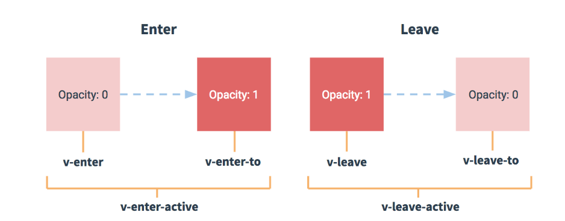

## 安装DevTools的Vue调试工具

> vue-devtools是一款基于chrome浏览器的插件，用于调试vue应用，这可以极大地提高我们的调试效率。接下来我们就介绍一下vue-devtools的安装。

谷歌游览器输入地址“**`chrome://extensions/`**”进入扩展程序页面，点击“加载已解压的扩展程序...”按钮，选择vue-devtools下的文件。

git中提供了 **`devtools`**  的压缩包,直接加载即可

> 然后, 在调试中就可以看到Vue的调试节点.可以通过组件的节点 查看组件的 **`data/props/computed`**

## 基础-路由-vue-router-动态路由传参 和 query传参

**`目标`** 掌握 Vue-router中路由的传参方式

我们经常遇到这种场景, 从**`列表页`** 跳转到 **`详情页`**

这种情况下 ,需要把点击列表项的id传到 详情页, 怎么做呢? 

> Vue-Router提供了两种方式

* **`第一种`**: 动态路由传参

1. (**`接收参数的`**)路由规则中增加参数，在path最后增加 **:id**, (id是可以随意命名的)

```json
{ name: 'users', path: '/users/:id', component: Users },
```

2. 通过 <router-link> 传参，在路径上传入具体的值

```html
<router-link to="/users/120">用户管理</router-link>
```

3. 在组件内部可以使用，**`this.$route`** 对象的**`params`**获取该参数

```js
var Users = {
    template: '<div>这是用户管理内容 {{ $route.params.id }}</div>',
    created() {
        console.log(this.$route.params.id);
    }
};
```

> 需要注意的是, 如果我们在上面的地址上 写了 /users, 匹配不到任何组件, 因为/users没有传参数, 如果我们想要**`/users/:id`**  能够匹配 **`/users`** ,我们应该 这么写路由规则

```json
{ name: 'users', path: '/users/:id?', component: Users },
```

> **`/users/:id?`**这么写表示, 不传id参数也可以匹配 组件

* **`第二种`** 查询参数query传参

除了通过 第一种形式传参, 我们还可以通过 在地址后面 **`? 名称=值`**的方式 进行传参, 如果有多个,可以**`用 &分割`**

1. 传递参数

```vue
<router-link to="/users?id=123" />
```

2. 获取参数, 我们可以通过 **`this.$route`**对象的**`query`**获取该参数

```js
var Users = {
    template: '<div>这是用户管理内容 {{ $route.query.id }}</div>',
    created() {
        console.log(this.$route.query.id);
    }
};
```

**`任务`**

 定义一个路由, 导航为 **`bkList`**(百科列表)和 **`bkInfo`**(百度详情)

点击百科列表中 **`明星`** 跳到 **`明星详情`**, 传入一个id

**`明星详情`** 根据传入的id 显示对应的 明星照片

## 基础-路由-to多种方式 和 路由重定向

**`目标`**掌握 vue-router中的to的多种赋值方式  和 路由的重定向

* to属性 有多种赋值方式  

> 可以直接是一个地址

```html
<router-link to="/sport">体育</router-link>
```

> 可以是一个对象,对象中可以是 path 地址 或者 name

```html
<router-link :to="{path:'/sport'}">体育</router-link>
```

```html
<router-link :to="{name:'abc'}">体育</router-link>
```

> 当选中某个导航之后, 可以通过激活class分别出 谁是的当前的**`激活导航`**

* 当我们选中了某个导航,可以通过激活class分别出 

```vue
	<a href="#/news" class="router-link-exact-active router-link-active">新闻</a>
```

>  审查导航元素,可以发现 激活样式

* 当希望某个页面被强制中转时  可采用**`redirect`** 进行**`路由重定向`**设置   

=>  A页面 (拦截请求) =>强制中转B页面, 只需要在A页面的路由位置 写一个redirect属性

```json
{
 path: "/sport",
 redirect: "/news", // 强制跳转新闻页
  component: {
   template: `<div>体育</div>`
   }
},
```

## 基础-路由-vue-router-编程式导航

**`目标`**掌握路由-vue-router-编程式导航

>  跳转不同的组件 不仅仅可以用router-link 还可以采用**`代码行为`**

**`this.$router`** 可以拿到当前路由对象的实例

路由对象的实例方法 有 **`push`**  **`replace`**, `go`()  `back`()

* push 方法 相当于往历史记录里**`增加`**了一条记录 如果点击返回 会回到上一次的地址
* replace方法 想相当于**`替换`**了当前的记录  历史记录并没有多 但是地址会变
* go(数字) 代表希望是前进还是回退,当数字大于0 时 就是前进 n(数字)次,小于0时,就是后退n(数字)次
* back 表示**`回到上一个`**页面

**`任务`**

用编程式导航实现

1. 实例化路由,定义四个组件  北京/上海/ 深圳/广州
2. 北京跳到上海, 上海可以返回到北京
3. 上海跳到深圳, 深圳不能返回上海
4. 上海到广州, 广州可以**`直接`**到北京 


## 基础-路由-vue-router-嵌套路由

**`目标`** 掌握如何实现一个嵌套路由

 我们会遇到这样一种场景, 在一级导航下,存在二级导航,比如 北京市下面还有 各个区县

这个时候,实际上就是需要做路由的嵌套

> 如果存在**`路由嵌套`**,就需要提供多个视图容器<router-view></router-view>

意思是:  你的一级导航对应的组件 需要 一级容器

​               你的二级导航对应的组件 需要二级容器

> 二级容器 需要写在一级路由的组件里面

> 二级路由的路由表 需要配置在一级路由的路由表的 **`children`** 下

   **`任务`** 

1. 实现一个嵌套路由   

2. 第一级路由为 热点 教育 社会 音乐
  3. 音乐下 二级路由为 流行.古典.爵士

  **要注意，`以 / 开头的嵌套路径会被当作根路径`。**

## Vue中的动画过渡

>**`目标`**掌握如何在Vuejs中实现动画过渡
>
>Vue 提供了 `transition` 的封装组件，在下列情形中，可以给任何元素和组件添加进入/离开过渡
>
>- 条件渲染 (使用 `v-if`)
>- 条件展示 (使用 `v-show`)
>- 动态组件
>- 组件根节点
>
>* 基本用法就是给我们需要动画的标签外面嵌套**`transition`**标签 ,并且设置name属性
>* Vue 提供了 `transition` 的封装组件，在下列元素更新,移除，新增 情形中，可以给任何元素和组件添加进入/离开过渡
>* 
>
>```html
><transition name="fade"> 
><div v-show="isShow" class="box"></div>
></transition>
>```
>
>6中class状态 
>
>1. v-enter：定义进入过渡的开始状态。
>2. v-enter-active：定义进入过渡生效时的状态。
>3. v-enter-to: 2.1.8版及以上 定义进入过渡的结束状态。
>4. v-leave: 定义离开过渡的开始状态。
>5. v-leave-active：定义离开过渡生效时的状态。
>6. v-leave-to: 2.1.8版及以上 定义离开过渡的结束状态。
>
>

**`注意`**  **`v`**要替换成transition组件的name属性值

**`注意`**先要编写元素的最终展示样式

**`任务`**

1. 实现一个div 显示时 从小到大过渡
2. 实现该div隐藏时 从大到小

## 基础-vue-cli安装和2-3-4版本解释

**`目标`**掌握vue-cli的版本安装

**`vue-cli`**是一个**`辅助开发工具`**=> **`代码编译`** + **`样式`** + 语法校验 + 输出设置 + 其他 ...

可以为开发者提供一个**`标准的项目开发结构`** 和配置  **`开发者`**不需要再关注

vue-cli 是一个**`命令行`**工具,本质上是一个**`npm`**包,也需要通过npm去安装下载

```bash 
$ npm i -g @vue/cli  # 全局安装脚手架  默认安装的最新版本 4.0+
```

安装完成后  可通过 **`vue命令`**来进行检查 脚手架是否安装成功

查看版本

```bash
$ vue -V  # 查看脚手架版本号  注意是大写V哦
```

默认安装的 4.0+ 版本,但是企业很多还在用2.0+版本 怎么破?

执行以下命令就可以 2.0 和 4.0 兼得

```bash
$ npm install -g @vue/cli-init  # 安装桥接工具 将2.0的功能补齐到目前的脚手架上
```

> Vue创建的项目并不是单一的, 有简单的结构,也有复杂的结构.

**`任务`**

1. 安装vue-cli脚手架 并 将2.0版本的补丁安装到当前版本

## 基础-vue-cli创建项目

**`目标`** 学会使用vue-cli 2.0特性创建项目

创建项目: 采用 vue-cli 2.0的特性 (生成简易模板)

```bash
#  heroes 创建的项目名称
$ vue  init webpack-simple heroes //  webpack-simple 为模板名称 固定写法
# 切换到当前目录
$ cd  heroes 
# 安装依赖
$ npm install  
# 在开发模式下 启动运行项目
$ npm run dev

```


创建项目: 采用 vue-cli 4.0 特性 (两种默认/选填)


```bash 
# 4.0下创建项目
$ vue create heroes // create(创建) 为关键字
# 切换到当前目录
$ cd  heroes 
# 在开发模式下 启动运行项目
$ npm run serve
```

4.0 +创建项目时  有两种模式, 一种**`默认模式`**, 一种**`选择模式`**,

默认模式:一种标准的模板

选择模式 可以根据自己的需求选择需要的工具和模式

**`任务`**

1. 分别使用vue-cli 2.0 和 3.0特性创建一个叫做heroes的项目 
2. 分别启动运行

## 基础-vue-cli项目目录解释

**`目标 `**对2.0项目目录生成的模板文件进行识别认识

>  .bablelrc=>存放 babel编译的配置信息  专门处理ES6转化成ES5的代码

> .editorconfig 帮助开发人员定义和维护一致的编码风格在不同的编辑器和IDE

> .gitignore 是配置git的忽略文件, 也就是你不希望被git追踪的文件都在这里 例如 node_modules

> index.html 我们所做的spa页面, index就是最终呈现的页面

> package.json 用于存放依赖信息 和其他项目信息

> README.md 项目的一些介绍信息

> webpack.config.js  一个打包工具 webpack的配置的文件,  webpack是一个前端工程化的工具  编译代码 -压缩代码- 处理代码,其他....

