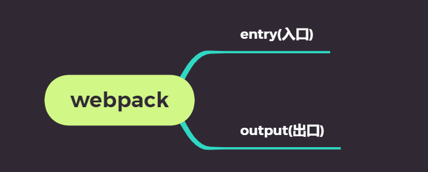
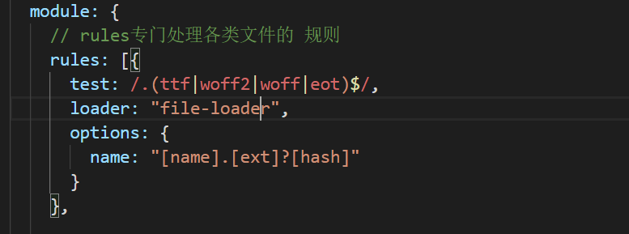

## 脚手架的运行模式介绍

**`目标`** 介绍脚手架的开发和运行模式

> 我们用脚手架 可以 轻而易举的启动一个项目, 这是怎么实现的 ? 

实际上,我们的脚手架是一个前后端的项目, 我们的 **`npm  run dev`** 实际上就是启动了这个项目服务, 开启一个默认的端口(**`8080`**)

> 运行的代码就是src里的代码吗? 

**`是!  也不是!`**  

什么意思呢 ? 实际上, **`npm run dev`** 运行的代码 是 **`src目录`**  的代码 **`编译之后`**的代码, 一旦我们修改了src下的代码,  此时 就会**`重新编译`**, 页面**`重新刷新`**, 

> 这是谁帮我们做的 ? 

**`webpack`**  , 是这个打包工具帮我们完成了 编译代码, 启动服务 等一系列的操作

我们可以通过 webpack.config.js 进行查看




上面的**`entry`**  表示 webpack 要编译文件的入口

**`output`**表示webpack 编译出来的文件输出的文件名及位置

> 我们发现, entry对应的是 src下的 main.js文件,  输出文件是 dist下的build.js

而且实际上,我们的单页应用 index.html 就是 引用了 build.js文件, 所以这也就是解释了 咱们一开始 的 

**`是!也不是!`**

>  而且, 你们可能会感觉疑惑, 并没有dist的物理目录啊? 为什么还可以访问?  

因为 webpack 可以实现**`热更新`**, 也就是改动src代码之后, 页面立刻变化, 所以为了提升效率,  webpack在**`dev`**的时候并不会生成**`物理文件`**, 而是将编译出的代码 用内存流的形式 输出到了前端, 这样做的目的是 为了提升开发和调试的效率 ,我们**`无须过多关注`**

我们在看 入口文件 **`main.js`**的时候  发现了一些新的语法  

```js
import Vue from 'vue'
import App from './App.vue'

new Vue({
  el: '#app',
  render: h => h(App)
})

```

import   from 

我们在下一节进行介绍

## 基础-回顾-ES6模块的导入和导出

**`目标`**   学习前端ES6的导入和导出

我们之前学习过 Commonjs 的导入和 导出, 也就是nodejs的导入和导出

Commonjs导入

```js
require('地址')  // 引入一个对象
```

Commonjs 导出

```js
module.exports = {} // 导出一个对象
```

> es6 新推出了 关于 导入导出的一种新方式, 在es6中一个文件可以默认为一个模块，模块通过**`export`**向外暴露接口，实现模块间交互等功能

* **`export default`**

```js
//一个文件即模块中只能存在一个export default语句，导出一个当前模块的默认对外接口
export default {}  // 导出一个对象
```

* **`import`**

```js
import  Example from '地址' // 可以引入一个export default的对象 如果是第三方包 可以只写包名
```

> 除了 导出一个**`默认对象`**外, export 还可以导出若干**`平常`**对象

```js
export const function  fn1() {} // 方法1
export const function  fn2() {} // 方法2
export const function  fn3() {} // 方法3
```

> 引用方式 则采用

```js 
import { fn1,fn2, fn3 } from '文件'
```

## 基础-入口解析及单文件组件

**`目标`**  掌握认识 入口文件 Vue的单文件组件

> 在文件入口**`main.js`** , 我们遇到了这样的代码

```js
import Vue from 'vue' 
import App from './App.vue'

new Vue({
  el: '#app',
  render: h => h(App)
})

```

> 上面 有两个东西 我们没有见过,   一个是**`.vue`**文件 , 一个是 **`new Vue()`**中的render

首先,我们认为一个**`.vue`**文件就是一个组件, 也就是**`单文件组件`**

然后,**`render`** 实际上就是 将 **`App.vue`**组件 渲染到了我们的**`el`**所对应的视图上, 它会**`替换`**el所对应的视图

所以,我们将App.vue组件 认为是整个项目的**`根组件`**, 我们开发的所有组件 或者路由都应该在 **`根组件`**的基础之上

```js
// main.js 作为整个项目的入口
// 入口 实例化了一个Vue实例
// Vue实例通过 render方法 将App.vue组件渲染到了页面上
// App.vue组件作为整个项目的根组件存在
// 以后开发项目 需要在根组件的基础之上去开发
// main.js是入口
// App.vue是根组件
```

****

> 单文件组件有什么特点

一个单文件组件 应该有这样几个要素

* **`template`**  就是 原来写组件的时候, 写的template属性,只不过被提出来 形成了一个单独的节点,写结构更加方便,有提示,效率更高 ,  **`有且只有一个根节点`**
* **`style`**  就是针对当前组件的样式表 可以写less /sass 等其他预处理器
* **`script`**  就是 除去template属性之外的所有组件属性和选项, **`需要导出`**一个组件对象,这样别人才能引用

> template的内容实际上 就是原有的组件的template,重新提升了一个节点, 方便我们有提示的进行开发.

```vue
<template>
   <div>内容</div>
</template>
<script>
  export default {}
</script>
<style>
</style>
```

> 当我们需要在一个组件中 使用另一个组件时,  首先要确定该组件 已经**`注册`**

注册的意思是:  要么该组件已经**`全局注册`**, 要么该组件**`局部注册`**在当前组件实例上

> 怎么注册呢? 

要通过 **`import`**   **`from`** 的方式 先把组件引过来, 然后 完成全局或者局部注册

**`任务`**  开发一个 商品列表  produce-list  组件


## 基础-示例项目效果演示及导入素材及样式

**`目标-任务`**:将项目所需样式导入到项目中 

* 安装 bootstrap固定版本

```bash 
npm i  bootstrap@3.3.7
```

安装完成之后 ,在入口处引入css文件

```js
import "./../node_modules/bootstrap/dist/css/bootstrap.css"; // 引入 bootstarp的样式文件
import "./assets/index.css"; // 引入index.css

```

重启运行,发现bootstrap.css文件 运行报错 

根据错误 需要在webpack.config.js增加对**`不识别文件`**的处理

```js	
{
 test: /.(ttf|woff2|woff|eot)$/,
 loader: "file-loader",
 options: {
   name: "[name].[ext]?[hash]"
 }
}
```

将上述的配置文件 加入到webpack.config中即可



## 基础-示例项目-提取公共组件-头部-侧边栏-列表,并预览效果

**`目标-任务`**:将静态内容的 头部 侧边栏 , 列表分别封装成Vue组件 ,并在视图中显示

**`路径`** 提取组件

1. 新建vue文件
2. 拷贝html静态内容到 template中
3. 在app.vue中引入注册组件
4. 注册在app.vue的组件中 
5. 在app.vue的模板中使用注册组件 

```vue
<template>
  <div id="app">
    <!-- 头部组件 -->
    <app-header></app-header>
    <div class="container-fluid">
      <div class="row">
        <!-- 侧边栏 -->
        <app-sidebar></app-sidebar>
        <!-- 英雄列表组件 -->
        <app-list></app-list>
      </div>
    </div>
  </div>
</template>

<script>
import appHeader from "./app-header"; // 引入头部组件
import appSideBar from "./app-sidebar"; //引入侧边栏组件
import appList from "./app-list"; // 引入英雄列表组件
export default {
  name: "app",
  components: {
    "app-header": appHeader, // 完成组件注册
    "app-sidebar": appSideBar, // 完成侧边栏组件的注册
    "app-list": appList // 完成对英雄列表的注册
  }
};
</script>

<style>
</style>

```


## 基础-示例项目-提取路由模块

**`目标-任务`** 在示例项目中 提取路由模块,并应用视图

1  安装路由 

```bash 
npm i vue-router // 安装路由模块
```

2   在main.js中引入 路由模块

```js
import VueRouter from 'vue-router ' // 引用router
```

3  使用router 

```js 
Vue.use(VueRouter) // 使用router  => 全局注册vue-router对象
```

4   实例化 router 

```js 
const router = new VueRouter({
routes:[] //实例化routes
})
```

5  配置理由表

```js
//  专门放置路由的
// 为什么要把文件命名index ?
// import test from './router'  如果 router是一个文件夹的话 
// import test from './router' 相当于 获取 import test from './router/index.js'文件
// import test from './router'  等价于 import test from './router/index' 
import Vue from 'vue'
import VueRouter from 'vue-router'  // 引用路由对象
import HeroList from '../views/heroes/hero-list'  // 单文件组件
import weaponList from '../views/weapon/weapon-list'  // 单文件组件
import GearList from '../views/gear/gear-list'  // 单文件组件

Vue.use(VueRouter) // 全局注册

const router = new VueRouter({
    // 配置路由表
    //  一般挂在路由上的组件 叫做 路由级组件
    // 路由级组件一般放置在src/views目录
    // views又可以新建文件夹 或者文件
    routes: [{
        path: '/heroes', // 定义路径 是自己定义的
        component: HeroList
    }, {
        path: '/weapon',
        component: weaponList  // 武器组件
    }, {
        path: '/gear',
        component: GearList // 装备组件
    }]
})

export default router // 导出一个变量
```
**注意** 一般来说 路由表 需要单独一个文件   可以将router提取成一个js文件 

6   提取 三个组件 hero-list(英雄列表)  weapon-list(武器列表) gearList(装备列表) 完善路由表

7   在App.vue中路由承载视图**`router-view`**

```html
<div>
<AppHeader></AppHeader>
<div class="row">
<AppSilder></AppSilder>
<div class="col-sm-9 col-sm-offset-3 col-md-10 col-md-offset-2 main">
<router-view></router-view> // 加入承载视图
</div>
</div>
 </div>
```

8. router--link默认生成的就是a标签,**`但是`**我们可以改变router-link最终生成的标签

> router-link  有一个属性 叫做 tag, 可以通过设置tag来改变 默认生成的标签 tag的值默认为**`a`**

```vue
<template>
  <!-- 侧边栏导航组件 -->
  <div class="col-sm-3 col-md-2 sidebar">
    <ul class="nav nav-sidebar">
      <!-- vuejs 中  tag属性可以改变 router-link中的生成默认标签-->
      <router-link tag="li" to="/heroes">
        <a href="#">英雄列表</a>
      </router-link>
      <router-link tag="li" to="/gear">
        <a href="#">装备列表</a>
      </router-link>
      <router-link tag="li" to="/weapon">
        <a href="#">武器列表</a>
      </router-link>
    </ul>
  </div>
</template>

<script>
export default {};
</script>

<style>
</style>
```


## 基础-示例项目-json-server-启动接口服务器

**`目标-任务`**准备json-server服务器.启动实现 数据接口 增删改查的联通

**`路径`**: 启动json-server服务器

1  安装json-server  

**注意** json-server 是一个命令行工具,和vue以及vue-cli没有任何关系 所以安装在任何位置都可以

```bash 
npm i -g json-server // 安装json-server 
```

2  新建json文件 

```json
{
"heroes": [
{ "name": "张三", "id": 1, "gender": "男" },
{ "name": "李白", "id": 2, "gender": "女" },
{ "name": "吕布", "id": 3, "gender": "男" }
]
}

```

3  启动json-server

```bash
json-server --watch db.json 
```

如果想 改变端口

```bash
$  json-server -w -p  3002 db.json #以特定的端口号启动命令
```

## 基础-示例项目-列表渲染

**`目标-任务`**完成英雄列表的数据加载及渲染

>**`路径`**:
>
>1 安装 axios 插件 
>
>```bash
>$ npm i axios #安装axios插件
>```
>
>2  英雄列表组件中引入 axios , 
>
>```js 
>import axiod from 'axios' // 引入axios
>```
>
>3  定义数据list
>
>```js
> data() {
>    return {
>      // 响应式数据
>      list: [] // 接收英雄列表的数据
>    }; // 因为组件数据是独立的
>  }
>```
>
>4  请求英雄列表的方法封装 
>
>```js
>    //  定义方法
>    loadData() {
>      axios.get("http://localhost:3001/heroes").then(result => {
>        // 拿到了result数据 赋值给 list axios封装了一层数据 我们应该取data
>        this.list = result.data;
>      });
>    }
>```
>
>5  在事件中加入 请求方法
>
>```js
>  created() {
>    // 实例创建完成事件
>    this.loadData(); // 获取列表数据
>  }
>```
>
>6  渲染列表list

## 基础-示例项目-删除功能

**`目标`**实现英雄列表的删除功能

>1  注册删除事件 
>
>```html
><a href="#" @click.prevent="delItem(item.id)">删除</a>
>```
>
>2 定义删除方法  实现删除逻辑
>
>```js
>    delItem(id) {
>      // 友好的提示一下
>      if (confirm("您是否要删除此条数据啊?")) {
>        // 调用删除接口
>        axios.delete(`http://localhost:3001/heroes/${id}`).then(() => {
>          // 如果删除成功了 会进入到then方法中
>              this.loadData(); //重新拉取数据
>        });
>      }
>```
>
>  3  根据状态 进行刷新页面
>  
>```js
>this.loadData(); // 刷新数据
>```
>
>

## 基础-示例项目-添加和编辑组件

**`目标-任务`**添加组件功能的静态实现

>1 新建add-edit.vue组件 并写入静态内容
>
>```html
>  <div>
>    <h2 class="sub-header">添加英雄</h2>
>    <form>
>      <div class="form-group">
>        <label for="exampleInputEmail1">姓名</label>
>        <input type="text" class="form-control" id="exampleInputEmail1" placeholder="请输入您的姓名" />
>      </div>
>      <div class="form-group">
>        <label for="exampleInputPassword1">性别</label>
>        <input type="text" class="form-control" id="exampleInputPassword1" placeholder="请输入您的性别" />
>      </div>
>      <button class="btn btn-success">添加英雄</button>
>    </form>
>  </div>
>```
>
>2  在路由表中配置添加功能的路由
>
>```js
>{ path: "/add-edit", component: AddEdit}  // 引入组件 配置路由
>```
>
>3  给列表组件中的添加按钮 添加l导航 到添加功能路由的导航
>
>```html
><!-- 给添加功能添加路由导航 -->
><router-link class="btn btn-success" to="/add-edit">添加</router-link>
>```
>
>4  根据业务场景调整页面模板
>
>```html
>  <div>
>    <h2 class="sub-header">添加英雄</h2>
>    <form>
>      <div class="form-group">
>        <label for="exampleInputEmail1">姓名</label>
>        <input type="text" class="form-control" id="exampleInputEmail1" placeholder="请输入您的姓名" />
>      </div>
>      <div class="form-group">
>        <label for="exampleInputPassword1">性别</label>
>        <input type="text" class="form-control" id="exampleInputPassword1" placeholder="请输入您的性别" />
>      </div>
>      <button class="btn btn-success">添加英雄</button>
>    </form>
>  </div>
>```
>

## 基础-示例项目-添加-功能实现

**`目标-任务`** 实现添加英雄的功能

>1  定义表单数据  和  表单进行绑定 
>
>```js
>data() {
>return {
>// 定义一个数据对象 存储 姓名和性别
>formData: {
>name: "", // 姓名
>gender: "" // 性别
>}
>};
>}  //定义一个数据对象
>```
>
>2 	注册添加按钮的点击事件 
>
>```html
><!-- 给添加英雄按钮注册一个事件 -->
>      <button @click.prevent="saveHero" class="btn btn-success">添加英雄</button>
>
>```
>
>3   实现 添加的前后逻辑
>
>```js
>    // 定义保存英雄方法
>    saveHero() {
>      // 首先应该判断 姓名和性别不能为空啊
>      if (this.formData.name && this.formData.gender) {
>        //  都存在才能保存
>        // 调用新增接口 restful => get /put /post /delete
>        axios.post("http://localhost:3001/heroes", this.formData).then(() => {
>          // 一旦进入then 说明新增成功了
>          // 回到列表页
>          //
>          this.$router.push("/heroes"); // 回到列表页
>        });
>      } else {
>        alert("兄嘚,得填全啊");
>      }
>    }
>```
>
>

## 基础-示例项目-编辑-功能实现

**`目标-任务`**实现英雄列表的编辑功能组件渲染

1. 添加-编辑组件路由支持传参

```json
{ path: "/add-edit/:id?", component: AddEdit }  // 引入组件 配置路由
```

2. 编辑按钮添加跳转路由的属性

```html
  <router-link :to="`/add-edit/${item.id}`">编辑</router-link>
```

3. 定义加载英雄方法  通过 $router.params来获取参数

```js
    // 加载对应的英雄
    loadHero() {
      if (this.$route.params.id) {
        // 如果id存在 表示 当前有id  表示当前是修改状态
        axios
          .get(`http://localhost:3001/heroes/${this.$route.params.id}`)
          .then(result => {
            //   获取到对应英雄的数据
            this.formData = result.data; // 将数据赋值给formData
          });
      }
    }
```

4. 在初始化事件中 调用loadHero 方法

```js
// 实例完成事件
created() {
this.loadHero(); // 加载英雄
}
```

5. 保存时 进行判断 是新增还是 编辑

   ```js
   saveHero() {
         // 首先应该判断 姓名和性别不能为空啊
         if (this.formData.name && this.formData.gender) {
           //  都存在才能保存
           // 调用新增接口 restful => get /put /post /delete
           if (this.$route.params.id) {
             // 应该调用 编辑接口
             axios
               .put(
                 `http://localhost:3001/heroes/${this.$route.params.id}`,
                 this.formData
               )
               .then(() => {
                 // 一旦成功了 说明编辑成功了  回到列表页
                 this.$router.push("/heroes"); // 回到列表页
               });
           } else {
             // 应该调用新增接口
             axios.post("http://localhost:3001/heroes", this.formData).then(() => {
               // 一旦进入then 说明新增成功了
               // 回到列表页
               //
               this.$router.push("/heroes"); // 回到列表页
             });
           }
         } else {
           alert("兄嘚,得填全啊");
         }
       },
   ```

